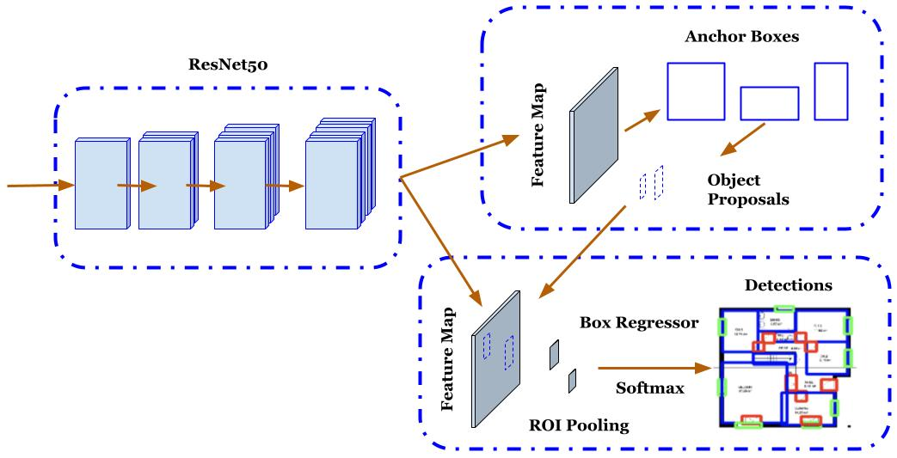
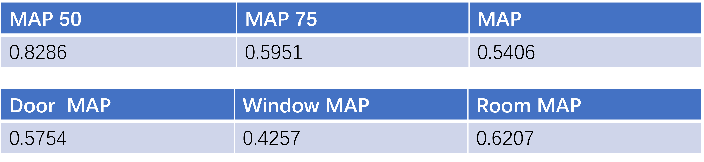
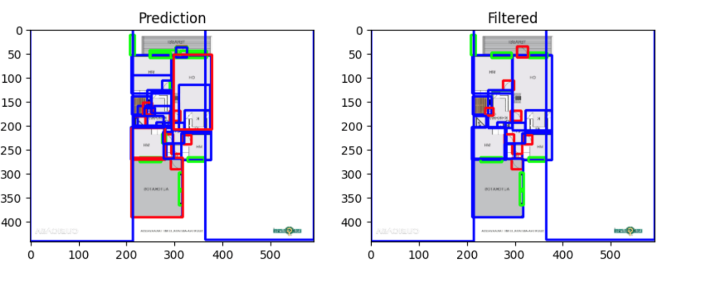
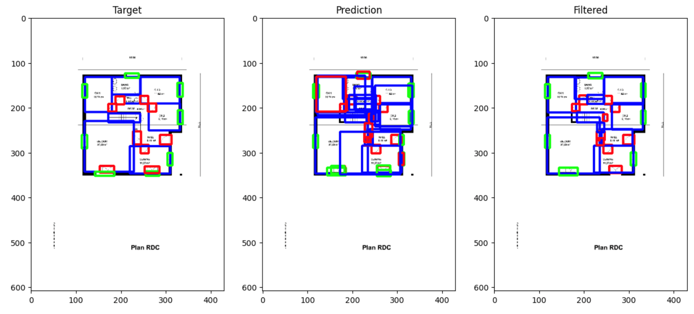

# Object Detection using Floorplan Dataset
## Detect rooms, windows and doors

### Fast RCNN with a ResNet 50 ###
The first part of this architecture is a ResNet50 to extract feature maps from images of floorplans. The generated feature map is first processed by a region proposal network (RPN) to find anchor boxes where the targeted objects will be included. The anchor boxes have two parameters: scale and aspect ratio. The PRN decides whether an anchor is an object and predicts the parameters for bounding boxes. The selected anchor boxes is combined with feature maps and applied with box regression and softmax to output the detected windows, rooms and doors. The Fast RCNN with ResNet 50 has been used for window, room and door detection.

Figure: Fast RCNN with ResNet50 as a Backbone

### Training Results and Evulation Metrics and Results ####
I selected an SGD optimiser with a batch size of 16, a learning rate of 0.01, and a momentum of 0.9. The learning rate is reduced by half after each epoch. The loss function is classification loss and objectness loss. This plot shows the training learning curve over batch iterations and epochs. The plot indicates that both training and validation losses decreased over training epochs, and no overfitting occurred during the training.

Figure: Training Results

Mean average precision evaluates the performance of object detection tasks derived from precision-recall curves. This figure shows MAP values under different intersection-over-unions (50% and 75%) and mean values from IOU from 50% to 95%. I also calculated IoU for individual classes. The results indicate that my algorithm has a good prediction for rooms, windows, and doors.

Figure: Mean Average Precision (MAP) Results 

### Non-Maximum Suppression ###
 Non-maximum suppression ranks bounding boxes according to their confidence scores, selects the bounding box with the highest confidence scores and removes all other bounding boxes that have overlaps with the selected bounding box. Non-maximum can prevent false positives in object detection. I found that the overlaps happened in my coding task, so I applied non-maximum suppression to reduce bounding boxes and make the results clearer. This figure shows an example of bounding overlaps, especially in blue boxes, and their impacts on detection results.

Figure: Non-maximum Suppression (NMS) Results (The Predicted Figure Is Before NMS, And The Filtered Is After NMS)

### An Example of Processed Floors ###
There are some examples of detection results. Rooms, windows and doors are precisely detected and marked in different colours. The figures show targeted, predicted and filtered floorplans.

Figure: An example of processed floorplans

### Summary and Future Work ###
##### Summary ####
- Faster R-CNN model fine-tuning
- 82.86% MAP at 50% IoU threshold on test set
##### Future Work ####
- Add preprocessing to further improve prediction (data augmentation, data cleaning and data denoising)
- The blanket areas on the floorplans can be removed to speed up training and increase accuracy
